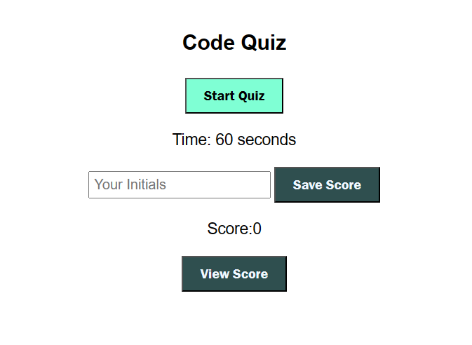

# Code Quiz Web App
Welcome to the Code Quiz web application! This interactive quiz allows users to test their coding knowledge by answering a series of questions and saving their scores. Users can also view high scores to see how they compare to others.

Getting Started
Prerequisites
To run this web application, you need a modern web browser that supports HTML, CSS, and JavaScript.

Usage
Open the web application in your browser.

Click the "Start Quiz" button to begin the quiz.

Answer the questions by selecting the correct option.

If you answer incorrectly, time will be deducted from the timer.

At the end of the quiz or when the timer reaches 0, the game is over.

Enter your initials and click the "Save Score" button to save your score.

High Scores
You can view high scores by clicking the "View Scores" button on the main page. Scores are saved in local storage, so they will persist even if you close the browser.

Website :
To access the password generator:

